# Bolus from a Garmin watch

Trio Companion lets a Garmin fēnix 8 send a bolus (and carbs) to Trio, the way the Apple Watch app can.
Trio runs the same safety checks it uses for remote commands, plus its own watch limit, before anything is delivered.

> **Use at your own risk.** This is a do-it-yourself add-on, not part of official Trio. Test it against Trio's
> simulated pump before using it with a real pump.

Screenshots are from the Connect IQ simulator (hence "DEMO DATA"); the replies come from a stand-in for Trio
that only exists in the simulator build (`./build.sh screenshots`).

## What you need

- A fēnix 8 (43 mm, 47 mm or Pro 47 mm).
- Trio built from the [`garmin-companion` branch of k9track/Trio-1](https://github.com/k9track/Trio-1/tree/garmin-companion)
  (Trio `main` plus the Garmin receiver).
- The **Trio Companion** watch app and **Trio Companion Face** installed (see the [README](../README.md#install-on-the-watch)).

## Set up (once)

1. **Trio:** Settings → Watch → Garmin → Trio Companion → **Watch Bolus**. Save a 4-digit PIN, check the watch maximum
   (default 3 U) and turn **Allow Bolus from Garmin** on.

   <!-- Trio settings screenshot: docs/screenshots/trio-watch-bolus-settings.png -->

2. **Watch:** open Trio Companion, hold UP → **Set PIN**, and enter the same 4 digits. UP/DOWN picks a digit, START adds it;
   the 4th digit saves.

   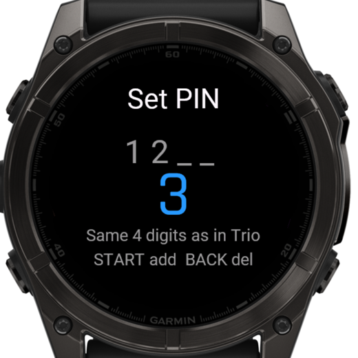

3. After installing a new version of the watch app, open it once from the apps list so the face can launch it.

## Give a bolus

From the Trio Companion Face, **touch and hold** the screen. The app opens on a lock screen: **tap 3 times quickly**
(or press START 3 times) to get to the insulin amount. This stops the app opening by itself when something presses
against the watch. If nothing is pressed for 20 seconds, the app closes and you're back on the face; it never closes
while a bolus is being sent or its result is showing.

| | | |
|:-:|:-:|:-:|
| 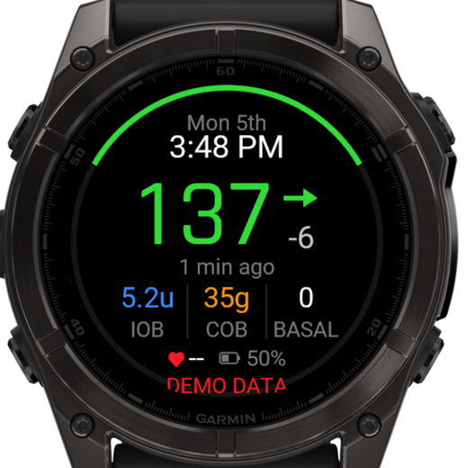 | 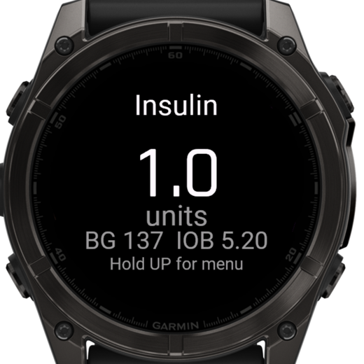 | 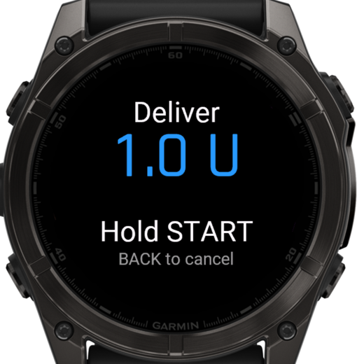 |
| Touch and hold the face, then tap 3 times | UP/DOWN sets the amount (quick presses jump by 0.5 U), START | Check the dose |
| 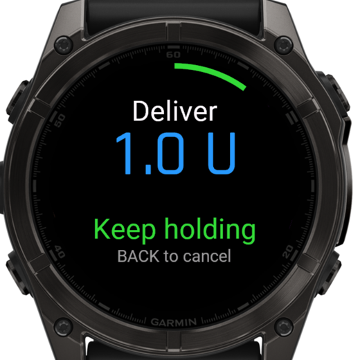 | 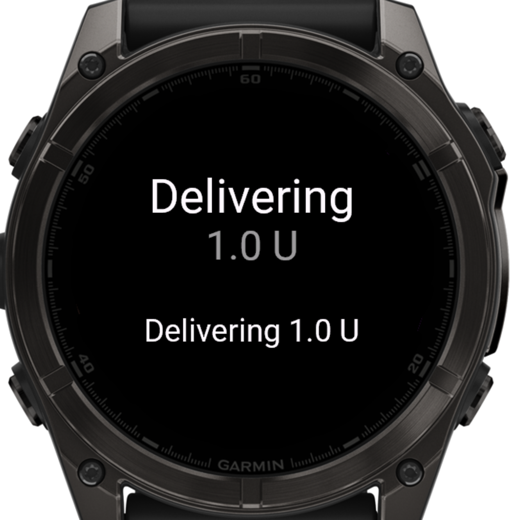 | 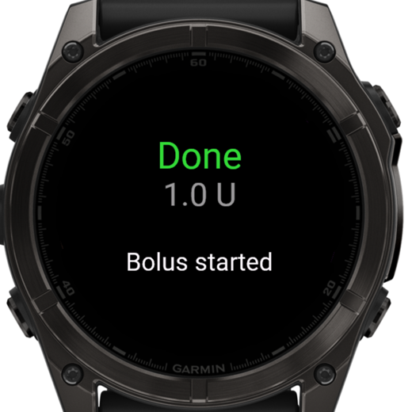 |
| **Hold START** about a second; a short press does nothing | Trio checked it and sent it to the pump | Pump started the bolus |

BACK cancels at any step before the hold completes.

## Carbs + bolus

Hold UP on the amount screen for the menu, then **Carbs + Bolus**. Set carbs first, then insulin (insulin can be 0 to log
carbs only). Carbs are saved in Trio with the note "Via Garmin", and if they can't be saved, no insulin is given.

| | | |
|:-:|:-:|:-:|
| 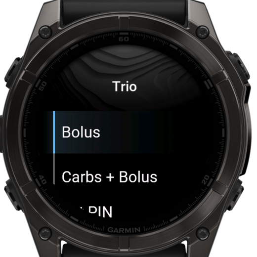 | 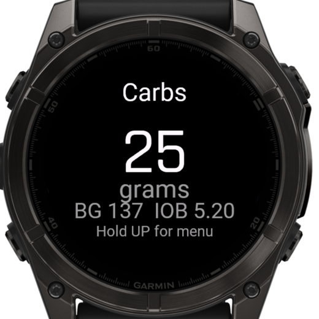 | 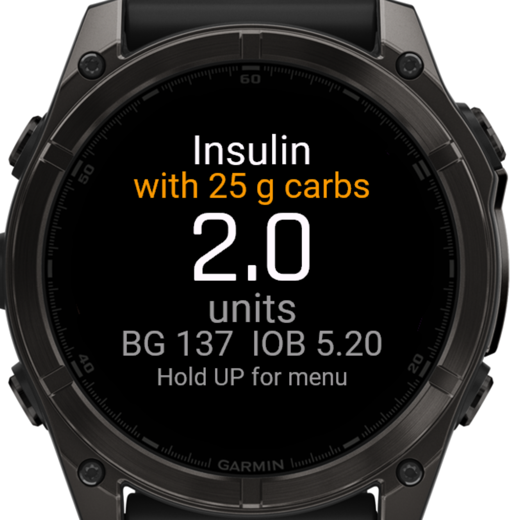 |
| Menu | Carbs (quick presses jump by 5 g) | Insulin for those carbs |
| 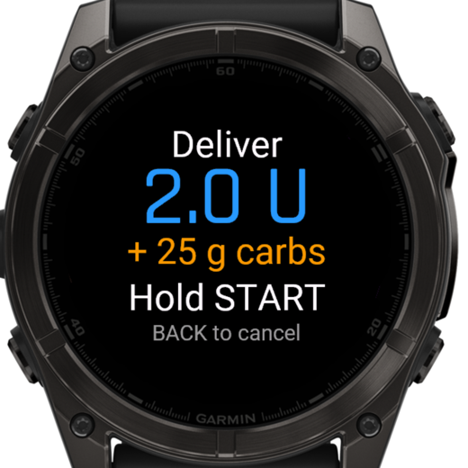 | 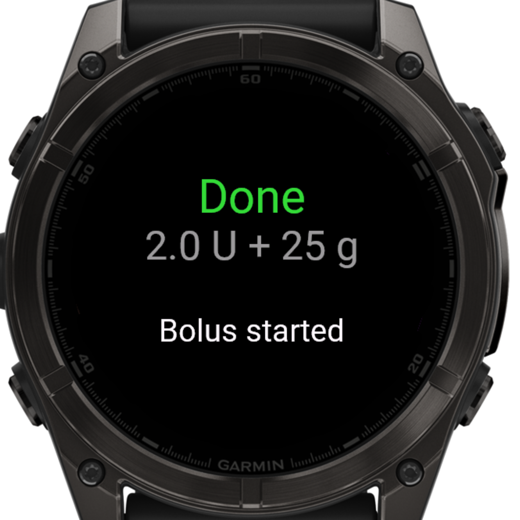 | |
| Hold START | Done | |

## When Trio says no

Nothing is saved or delivered, and the watch shows why.

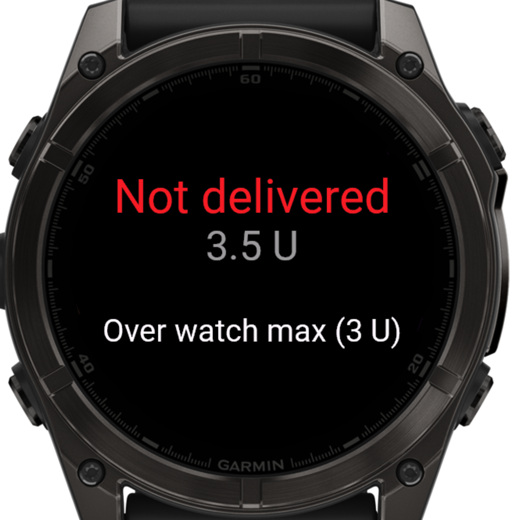

Trio rejects a watch request when:

- watch bolus is turned off in Trio, or no PIN is set;
- the PIN on the watch doesn't match Trio's;
- the request is more than 60 seconds old or was already used (it can't be replayed);
- another watch request is still in progress;
- carbs are over Trio's **Max Carbs**, or insulin is over the **watch maximum**;
- insulin is over the pump's **Max Bolus**, would go over **Max IOB**, or a bolus of 20 % or more of this one was
  given in the last few minutes.

If the watch shows **Check Trio**, it couldn't confirm what happened (no reply, or the message may not have arrived).
Look at Trio before trying again; the watch never resends on its own.

## In Trio

<!-- Trio history screenshot: docs/screenshots/trio-history.png -->

How the messages are built and checked: [PROTOCOL.md](../PROTOCOL.md).
